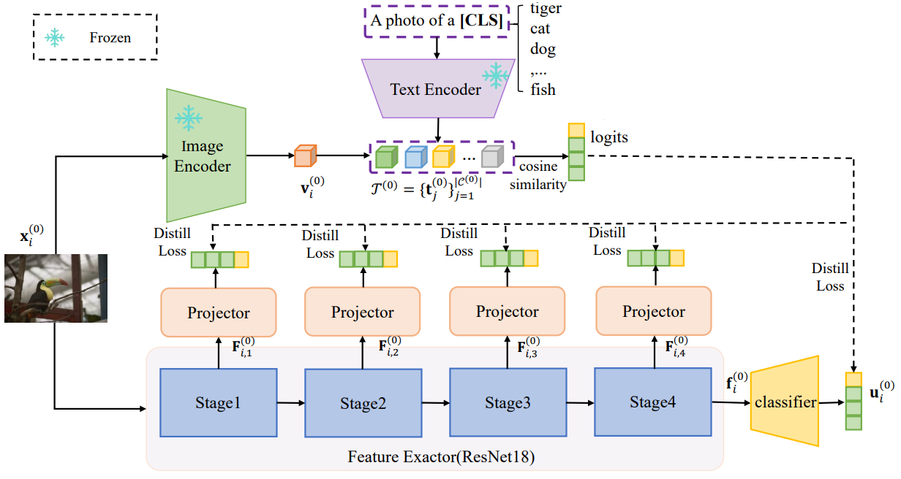
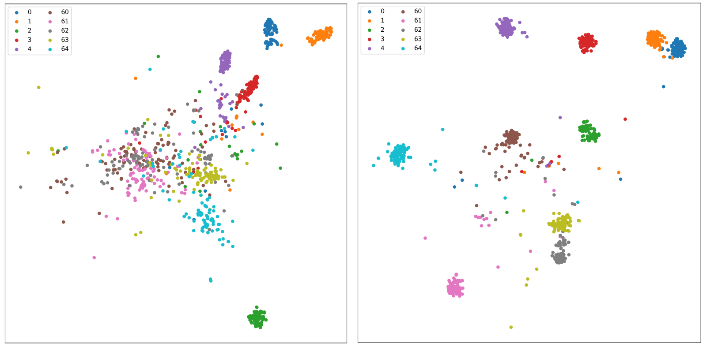

# CSKD
This repository contains the implementation code for paper: **Class Semantics guided Knowledge Distillation for Few-Shot Class Incremental Learning**

## Introduction

Few-shot class-incremental learning aims to recognize novel classes from limited samples while predicting those old classes including base ones.Since only limited samples are used for training and the model has no access to old classes at the incremental phase, it brings about the problem of catastrophic forgetting on old classes and over-fitting on novel ones. To address these issues, this work presents a Class Semantics guided Knowledge Distillation (**CSKD**) for few-shot class-incremental learning. In the base session, it leverages the pre-trained vision-language model CLIP (Contrastive Language-Image Pre-Training) to optimize the base model by knowledge distillation. In the incremental session, it utilizes the class textual semantics derived from CLIP to guide the classifier optimization, which alleviate the over-fitting problem on novel classes. Extensive experiments on mini-ImageNet, CUB-200, and CIFAR100 demonstrate the superiority of the proposed method compared to several competitive alternatives,especially exhibiting its promising generalization ability on novel classes.



## Dependencies
- [PyTorch >= version 1.8.1](https://pytorch.org)
- numpy=1.24.3
- tqdm=4.66.4
- opencv-python=4.10.0
- pandas=2.0.3
- pillow=10.4.0
- Dassl(https://github.com/KaiyangZhou/Dassl.pytorch)

```
conda create -n uesd python=3.8.19 
```

Install dependency packages

```
pip install -r requirements.txt
```

## Datasets
- [mini-imagenet](https://github.com/renmengye/few-shot-ssl-public#miniimagenet) 

```
CSKD/
└── miniImageNet/
  │   ├── train.csv  
  |	  ├── test.csv  
  |	  ├── val.csv  
  │   ├── images/
  │   │   └── n01930112
  |	  |   		└── .png(image files)
```

## Code Structures
There are five parts in the code.
 - `models`: It contains the backbone network and training protocols for the experiment.
 - `data`: Images and splits for the data sets.
 - `dataloader`: Dataloader of different datasets.
 - `augmentations`: augmentations methods.
- `pretrain`: The pre-trained  and local model. You can download the pre-trained clip weights from [mlfoundations/open_clip: An open source implementation of CLIP. (github.com)](https://github.com/mlfoundations/open_clip)
 - `config`:  train config file
 - `checkpoints`: To save the trained models.

## Training&Test

Just run `train.py` for training and testing:

```
bash run.sh
```

Remember to change data path into your own data root. 

## Quantitative results on mini-ImageNet

|       |   0   |   1   |   2   |   3   |   4   |   5   |   6   |   7   |   8   |  Avg  |
| :---: | :---: | :---: | :---: | :---: | :---: | :---: | :---: | :---: | :---: | :---: |
| CSKD | 83.50 | 77.40 | 72.89 | 68.45 | 66.16 | 63.15 | 60.12 | 58.98 | 57.90 | 67.62 |

The table shows the accuracy of the model in different incremental stages, 0 represents the base stage, 1-8 represents the incremental stage, and Avg represents the average accuracy.

## Qualitative results on mini-ImageNet



The above figure shows the distribution of some test samples in the embedding space of the model on mini-ImageNet. The left figure shows the feature extractor trained by the ordinary fully supervised classification method, and the right figure shows the proposed CSKD. The numbers 0-4 represent the base class and 60-64 represent the new class

## Citation

```
@article{li-CSKD,
  author    = {Ping Li and Jiajun Chen and Shaoqi Tian and Ran Wang},
  title     = {Class Semantics guided Knowledge Distillation for Few-Shot Class Incremental Learning},
  journal   = {},
  volume    = {},
  pages     = {},
  year      = {2025},
}
```

## Contact
If you have any questions, please feel free to contact Mr. Jiajun Chen via email( [241050087@hdu.edu.cn](mailto:241050087@hdu.edu.cn).). 

## Acknowledgment

We thank the following repositories providing helpful components/functions in our work.

- [SVAC](https://github.com/zysong0113/SAVC)
- [CEC](https://github.com/icoz69/CEC-CVPR2021)

- [SLA](https://github.com/hankook/SLA)
- [Revisiting-Contrastive-SSL](https://github.com/wvangansbeke/Revisiting-Contrastive-SSL)
- [unimoco](https://github.com/dddzg/unimoco)
